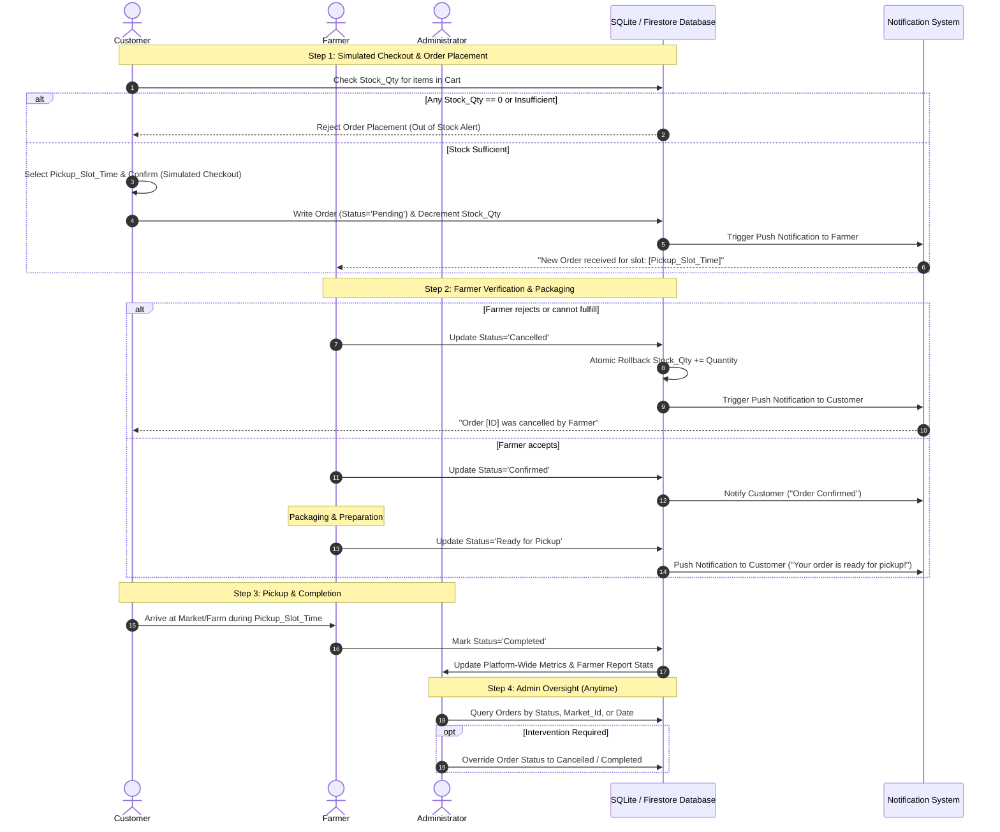

# TECHNICAL SPECIFICATION: ORDER LIFECYCLE & STATE MACHINE
**System:** HarvestHub - Marketplace for Local Farm Products (TechWiz Specification)  
**Roles:** `Customer`, `Farmer`, `Administrator`  
**Storage Architecture:** NoSQL (Cloud Firestore / Firebase) / SQLite Schema  
**Scope Constraints:** In-store / On-farm Pickup Only (No external delivery logistics), Simulated Checkout (No live payment gateway), AI & Event-driven Notifications.

---

## 1. DATA ENTITIES & SCHEMAS

### 1.1 Data Schema References
```json
{
  "Orders": {
    "Order_Id": "String (UUID / Firestore Doc ID)",
    "Customer_Id": "String (Ref: Users.User_Id)",
    "Farmer_Id": "String (Ref: Farmers.Farmer_Id)",
    "Market_Id": "String (Ref: FarmersMarket.Market_Id, nullable)",
    "Items": [
      {
        "Product_Id": "String (Ref: Products.Product_Id)",
        "Item_Name": "String",
        "Price_Per_Unit": "Number (Float)",
        "Quantity": "Integer",
        "Subtotal": "Number (Float)"
      }
    ],
    "Pickup_Slot_Time": "Timestamp / ISO8601 String",
    "Status": "String (Enum: Pending | Confirmed | Ready for Pickup | Completed | Cancelled)",
    "Total_Price": "Number (Float)",
    "Created_At": "Timestamp",
    "Updated_At": "Timestamp"
  },
  "Products": {
    "Product_Id": "String",
    "Farmer_Id": "String",
    "Item_Name": "String",
    "Category": "String",
    "Price_Per_Unit": "Number",
    "Stock_Qty": "Integer",
    "Image_Url": "String"
  }
}
```

---

## 2. STATE MACHINE SPECIFICATION

### 2.1 State Definitions
- `Pending`: Order created by Customer with simulated payment. Inventory decremented. Waiting for Farmer confirmation.
- `Confirmed`: Farmer acknowledges receipt and commits to preparing products for the specified pickup slot.
- `Ready for Pickup`: Products harvested, packaged, and held at the pickup site/market.
- `Completed`: Customer collected items; Farmer or Admin marked transaction finalized.
- `Cancelled`: Terminal abort state. Inventory automatically rolled back (`Stock_Qty += OrderItem.Quantity`).

### 2.2 Transition Rules Matrix

| From State | Target State | Permitted Roles | Trigger Action / Preconditions | DB Side Effects |
| :--- | :--- | :--- | :--- | :--- |
| `[CART_ACTIVE]` | `Pending` | Customer | Submit Simulated Order; `Stock_Qty >= Requested_Qty` for all items. | Create `Orders` record; atomic decrement `Stock_Qty`; push notify Farmer. |
| `Pending` | `Confirmed` | Farmer, Admin | Farmer accepts the preparation schedule. | Set `Status = 'Confirmed'`; update `Updated_At`; push notify Customer. |
| `Pending` | `Cancelled` | Customer, Farmer, Admin | Rejection by Farmer, change of mind by Customer, or administrative override. | Set `Status = 'Cancelled'`; rollback `Stock_Qty`; push notify affected party. |
| `Confirmed` | `Ready for Pickup` | Farmer | Items packaged and awaiting collection at `Pickup_Slot_Time`. | Set `Status = 'Ready for Pickup'`; push notify Customer to pick up. |
| `Confirmed` | `Cancelled` | Farmer, Admin | Unforeseen spoilage or force majeure. | Set `Status = 'Cancelled'`; rollback `Stock_Qty`; push notify Customer. |
| `Ready for Pickup`| `Completed` | Farmer, Admin | Handover verified at pickup location. | Set `Status = 'Completed'`; trigger revenue record updates. |
| `Ready for Pickup`| `Cancelled` | Farmer, Admin | Customer failed to arrive (No-Show) within pickup window. | Set `Status = 'Cancelled'`; optional inventory restock (spoilage dependent). |

---

## 3. MULTI-VENDOR CART PARTITIONING ALGORITHM

Because customers can put products from different farmers into a single cart, and each order record strictly maps a single `Customer_Id` to a single `Farmer_Id`:

```
Input: Master Cart containing N items [item_1, item_2, ... item_n]
Process:
  1. Group cart items by item.Farmer_Id -> Map<Farmer_Id, List<CartItem>>
  2. For each entry (farmerId, subItems) in Map:
       a. Validate all subItems have Stock_Qty >= subItem.Quantity.
       b. Require Customer to select a valid Pickup_Slot_Time for this specific farmerId.
       c. Compute Sub_Total = sum(item.Price_Per_Unit * item.Quantity).
       d. Generate new Document in `Orders` collection:
            Order_Id = auto_generated()
            Customer_Id = currentUser.id
            Farmer_Id = farmerId
            Items = subItems
            Pickup_Slot_Time = selectedSlot
            Status = "Pending"
            Total_Price = Sub_Total
       e. Atomic DB transaction: Decrement `Stock_Qty` for each product.
       f. Dispatch push notification to Farmer (target: farmerId).
  3. Clear matching items from Customer's Shopping Cart.
```

---

## 4. DETAILED ROLE-BASED WORKFLOW



---

## 5. BUSINESS RULES & EDGE-CASE PROTOCOLS

1. **Zero-Stock Prevention (SRS Core Constraint):**
   - The UI and DB transaction must prevent order creation if `Stock_Qty == 0`.
   - If stock falls below zero during a race condition, the database transaction must abort and prompt the user.

2. **No-Show Handling:**
   - If the current system time exceeds `Pickup_Slot_Time` + 12 hours and status remains `Ready for Pickup`, system flags order for Farmer/Admin review to switch to `Cancelled`.

3. **Simulated Financial Transactions:**
   - No payment token or external checkout handshake is required.
   - Payment status is implicitly treated as settled upon creation, with revenue logged strictly for dashboard aggregation.

4. **Event-driven Inventory Notifications:**
   - If `Cancelled` occurs, inventory is restocked. If an item on a customer's Wishlist transitions from `Stock_Qty == 0` to `Stock_Qty > 0`, dispatch restock push notifications to subscribed customers.