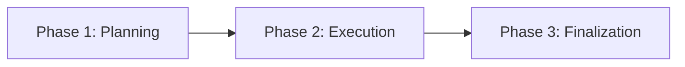

# TECHWIZ 7 STANDARDS: MULTI-PLATFORM APP COMPUTING
## Production-Grade Guidelines for Flutter Development

---

## 1. Objectives & Evaluation Metrics

- **Evaluation Metrics:** Understand and target the exact evaluation criteria used by industry experts and academic reviewers during project grading.
- **Engineering Quality:** Apply production-level standards for clean, maintainable, secure, and high-performance cross-platform software.
- **Responsible AI:** Leverage modern AI assistance effectively while adhering strictly to academic integrity and competition rules.

---

## 2. What Makes a Project Stand Out

| Metric |  Loses Points (Team Alpha Anti-Patterns) |  Scores High (Team Beta Production Standards) |
| :--- | :--- | :--- |
| **Architecture** | Monolithic files mixing UI, business logic, and data. | Clean separation of Presentation (UI), State Management, and Data layers. |
| **Documentation** | No setup guide, architecture diagram, or API specs. | Comprehensive `README.md` with system diagrams and setup walkthroughs. |
| **Secrets & Config** | Hardcoded credentials, database strings, or API keys. | Strict environment variable security (`.env`) excluded via `.gitignore`. |
| **Git Workflow** | Single bulk commit submitted right before deadline. | Regular, structured commits showing steady cross-team progression. |
| **Reliability** | Unhandled edge cases, missing error boundaries. | Graceful error handling, retry mechanisms, and informative user feedback. |
| **Code Health** | Unused dependencies, dead code, compiler warnings. | Automated linting passing with **0 warnings** and **0 errors**. |

---

## 3. Naming Conventions & Coding Rules (Dart / Flutter)

- **Classes, Widgets & Enums:** Use `PascalCase` nouns; descriptive and unambiguous.
  - *Examples:* `OrderProcessor`, `UserProfileCard`, `UserRole`
- **Methods & Functions:** Use `camelCase` verbs.
  - *Examples:* `calculateTotal()`, `fetchFarmerRecords()`, `validateInput()`
- **Variables & Properties:** Use `camelCase` with explicit type annotations where beneficial.
  - *Examples:* `orderId`, `totalAmount`, `isLoggedIn: bool`
- **Constants:** Use `SCREAMING_SNAKE_CASE` or consistent uppercase naming.
  - *Examples:* `MAX_RETRY_ATTEMPTS`, `TIMEOUT_MS`, `DEFAULT_CACHE_DURATION`

---

## 4. Static Analysis & Code Quality Tools

1. **Automated Linters:** Run `flutter analyze` frequently to achieve and maintain zero errors and zero critical warnings.
2. **Real-time IDE Inspection:** Utilize tools like the **SonarLint** plugin to catch security flaws, code smells, and dead code during development.
3. **Reproducible Manifest:** Pin exact versions of dependencies in `pubspec.yaml` to ensure consistent builds across different development and grading machines.

---

## 5. Performance Optimization

### 1. Search & Collection Lookup
- **Slow $O(N^2)$ Approach:** Nested loops iterating through full lists on the main UI thread.
- **Optimized $O(N)$ / $O(1)$ Approach:** Pre-index data into hash maps (`Map<Key, Value>`) or sets for instant lookup without UI stutters.

### 2. Memory & String Allocation
- **Slow Approach:** Repeated string concatenation (`+` or `+=`) inside loops, causing excessive garbage collector pressure.
- **Optimized Approach:** Use `StringBuffer` to efficiently reuse internal buffers for logs, formatted strings, and export generation.

### 3. Database & Network Queries
- **Eliminate $N+1$ Queries:** Avoid calling the database or network inside iteration loops.
- **Batching & Aggregation:** Fetch relational data using aggregated queries, batching, or single server-side queries.

---

## 6. Security Best Practices

### 1. Secrets & Credentials Management
- **Unsafe:** Hardcoding API keys, tokens, service account credentials, or database passwords in source code.
- **Secure:** Load all secrets from `.env` files or secure storage vaults; always add `.env` and sensitive configurations to `.gitignore`.

### 2. Injection & Query Defense
- Never concatenate raw user input into query strings or API payloads.
- Use parameterized queries, type-safe models, and validate inputs at application entry points.

### 3. Safe Content Rendering
- Treat external user content as unverified text. Sanitize data before rendering to prevent script injection or layout breaking.

---

## 7. Team Strategy & Responsible AI

### Execution Workflow

- **Phase 1: Planning**
  - Analyze judging rubrics in detail.
  - Design database schemas, data models, and API contracts.
  - Initialize the Git repository and repository branching strategy.
- **Phase 2: Execution**
  - Implement core modules following a layered architecture.
  - Enforce peer code reviews and run automated linters on pull requests.
  - Write integration and unit tests for mission-critical flows.
- **Phase 3: Finalization**
  - Cross-platform verification (Android, iOS, Web, Desktop).
  - Remove all debug flags, temporary print logs, and unused packages.
  - Finalize demonstration video, presentation slides, and repository documentation.

### Responsible AI Framework (6 Steps)
> AI should assist and accelerate the development process, not author unverified code blindly.

1. **Learn:** Understand problem statements, edge cases, and business constraints thoroughly.
2. **Architect:** Design data structures, domain models, and state management flow independently.
3. **Consult AI:** Prompt AI for specific boilerplate, helper algorithms, or widget layout ideas.
4. **Verify:** Scrutinize generated code for security risks, null-safety, and edge cases.
5. **Refine:** Profile and benchmark execution performance.
6. **Defend:** Ensure team members understand and can confidently defend every architectural decision before the jury.

---

## 8. 15-Point Pre-Submission Master Checklist

- [ ] **1. STRUCTURE:** Repository contains a comprehensive `README.md` with system architecture diagrams and clear setup steps.
- [ ] **2. SECRETS:** Private API keys, credentials, and connection strings are managed via `.env` and excluded from Git history.
- [ ] **3. CONVENTIONS:** Source code strictly follows Dart/Flutter naming standards (`PascalCase` for types, `camelCase` for functions/variables).
- [ ] **4. QUALITY:** Automated linters (`flutter analyze`) execute cleanly with **zero warnings and zero errors**.
- [ ] **5. PERFORMANCE:** Critical loops avoid $O(N^2)$ lookups, excessive string allocations, and $N+1$ network calls.
- [ ] **6. SECURITY:** All input parameters are validated, sanitized, and passed via parameterized queries.
- [ ] **7. DEFENSIBILITY:** Team members can clearly articulate the purpose and architecture of all committed code during Q&A.
- [ ] **8. BUILD:** The project builds cleanly from a fresh `git clone` on a clean machine environment.
- [ ] **9. MANIFEST:** All package dependencies are pinned with compatible version ranges in `pubspec.yaml`.
- [ ] **10. CLEANLINESS:** Debug flags, debug banners, mock `print()` statements, and scratch files are removed.
- [ ] **11. TESTING:** Edge cases (empty views, loading skeletons, network dropouts) display graceful user feedback.
- [ ] **12. DEPLOYMENT:** The demo application is verified, operational, and accessible for evaluation.
- [ ] **13. GIT HISTORY:** Version control shows consistent, descriptive commit history reflecting distributed teamwork.
- [ ] **14. AI INTEGRITY:** AI assistance is properly disclosed in `ATTRIBUTION.md` adhering to competition guidelines.
- [ ] **15. LOGISTICS:** Video demonstration is recorded within time constraints, and backup archives are prepared ahead of time.
